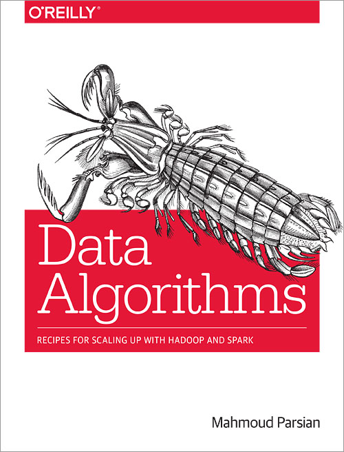

[Santa Clara University](http://scu.edu/)
-----------------------------------------

[Big-Data-MapReduce-Course](https://www.scu.edu/business/ms-information-systems/curriculum/msis-courses/)
----------------------------

## Winter 2020
## Course MSIS 2631: Machine Learning
* Graduate School, Leavey School of Business
* Department of Information Systems & Analytics
* Class meeting dates: 
	* Start: January, 2020
	* End: March, 2020
* Class hours:  
	* Monday 5:45:00 PM 7:20:00 PM
	* Wednesday 5:45:00 PM 7:20:00 PM
* Instructor: [Mahmoud Parsian](https://www.scu.edu/business/isa/faculty/parsian/)
* Class room: Lucas Hall 307 
* Office: 216AA, 2nd Floor, Lucas Hall
* Office Hours: by appointment

## Required Books

* `1.`[Hands-On Machine Learning with Scikit-Learn, 2nd Edition](https://www.amazon.com/Hands-Machine-Learning-Scikit-Learn-TensorFlow/dp/1492032646/)
* `2.`[PySpark Algorithms Book by Mahmoud Parsian](https://www.amazon.com/dp/B07X4B2218/ref=sr_1_2)
	* [Buy from amazon.com -- PySpark Algorithms Book -- PDF Version](https://www.amazon.com/PySpark-Algorithms-Mahmoud-Parsian-ebook/dp/B07WQHTVCJ/)
	* [Buy from amazon.com -- PySpark Algorithms Book -- Kindle Version](https://www.amazon.com/PySpark-Algorithms-Version-Mahmoud-Parsian-ebook/dp/B07X4B2218/)
	* [Source code @github.com -- PySpark Algorithms Book by Mahmoud Parsian](https://github.com/mahmoudparsian/pyspark-algorithms)
* `3.`[Mining of Massive Datasets by Jure Leskovec, Anand Rajaraman, Jeffrey D. Ullman](http://infolab.stanford.edu/~ullman/mmds/book.pdf)

## Required Software: 

* [scikit-learn - Machine Learning in Python](https://scikit-learn.org/stable/)
* [Apache Spark Site](http://spark.apache.org/)

## [Syllabus](./syllabus/winter-2020/)
----------------------------

## Midterm Exam:
* Midterm Exam Date: **TBDL 2020**
* Midterm Exam Time: **TBDL PST**

## Final Exam: 
* Final Exam Date: **TBDL 2020**
* Final Exam Time: **TBDL PST**

----------------------------

## Course Description

This course introduces participants to quantitative techniques 
and algorithms that are based on big data (numerical and textual) 
or are theoretical models of big systems or optimization that are 
currently being used widely in business. It introduces topics that 
are often qualitative but that are now amenable to quantitative 
treatment. The course will prepare participants for more rigorous 
analysis of large data sets as well as introduce machine learning 
models and data analytics for business intelligence.

The main focus of this class is to cover the following concepts:

* Basic concepts of Machine Learning
* Linear Regression
	* scikit-learn
	* Spark ML
* Logistic Regression
	* scikit-learn
	* Spark ML
* Principal Component Analysis (PCA)
	* scikit-learn
	* Spark ML
* Clustering
	* K-means
	* Latent Dirichlet allocation (LDA)
	* scikit-learn
	* Spark ML

---------------------------

## My latest books: 

[PySpark Algorithms Book](https://www.amazon.com/dp/B07X4B2218/ref=sr_1_2)
======================
PySpark Algorithms

[Data Algorithms Book](http://shop.oreilly.com/product/0636920033950.do)
======================
Data Algorithms: Recipes for Scaling up with Hadoop and Spark

